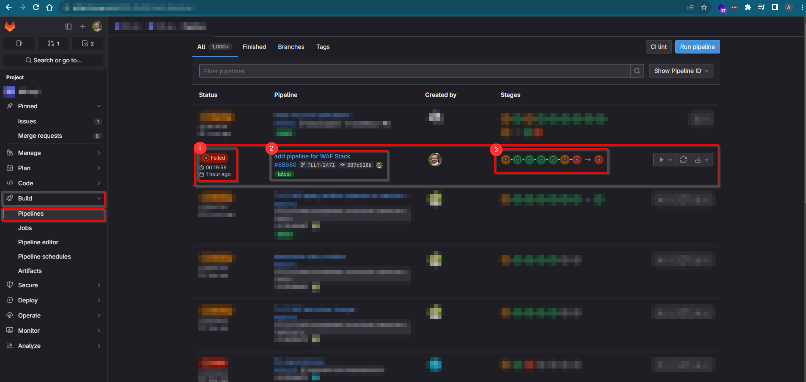

# Pipelines


## Introduction

Gitlabs allows you to automate and orchastrate the process of building, testing a deploying code through difffrent enviroments like diffrent cloud regions and cloud providers. 

## Automation

Pipelines automate the process of buidling testing and deploying like mentioned above, automation helps with consistent deployments and lesser manual errors, speeding up the development lifecycle (weekly releases). with Gitlab pipeline and we can define these stages in code form and save them in a gitlab file that is exececuted whenever there is a change in the repository. 

#### Code Example for staging

```yml
include:
  - local: .gitlab/templates/cache-pull.gitlab-ci.yml

default:
  image: (where the image is stored)
  tags:
    - docker-large

stages:
  - pre
  - stage 1
  - stage 2
  - stage 3
  - final
```
an example of a the first stack is given below 

#### Stack Code

usually you would find these codes in a ".gitlab" folder i was working with AWS CDK on this project so it was under a cdk-deploy.yml 
**Please note some code like "Stack_Name" have been hidden and images do not corrospond directly to the code for confideiality reasons** 

```yml 
layers:
  extends:
    - .common_cdk_deploy_single_stack
  stage: stage 1
  variables:
    STACK_NAME: 

storage:
  extends:
    - .common_cdk_deploy_single_stack
  stage: stage 1
  variables:
    STACK_NAME: 

custom-metrics:
  extends:
    - .common_cdk_deploy_single_stack
  stage: stage 1
  variables:
    STACK_NAME: 

vpc:
  extends:
    - .common_cdk_deploy_single_stack
  stage: stage 1
  variables:
    STACK_NAME: 

cloudfront-certificate:
  extends:
    - .common_cdk_deploy_single_stack
  stage: stage 1
  variables:
    STACK_NAME: 
```
## GUI Gitlab Pipeline

The image show the Pipeline i asked to merge into the development branch that failed, in the picture there are 3 important sections, The Status (1), The Pipeline (2), and The Stages (3). 




### The Status


### The Pipeline


### Stages
